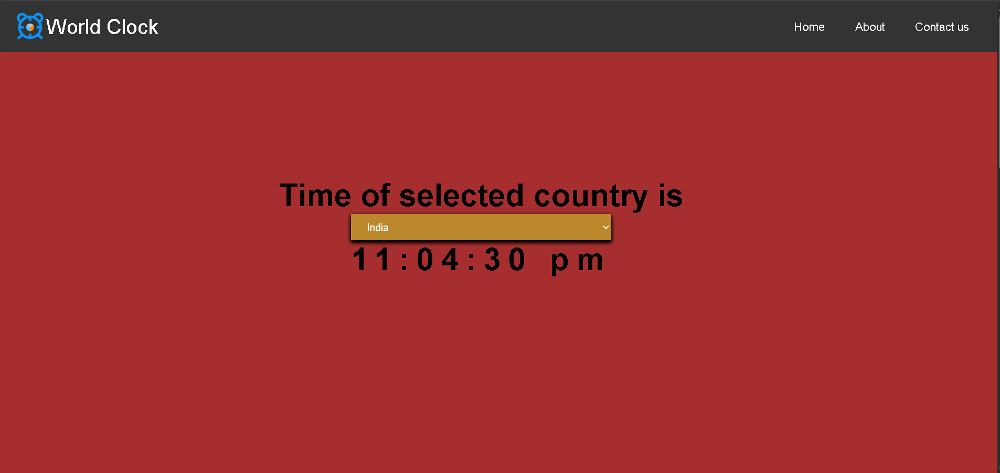

# 🌍 World Clock Web App

A simple yet elegant **World Clock** built using HTML, CSS, and JavaScript.  
It allows you to check the current time in multiple time zones around the world, with live updates.

---

## ✨ Features

- ⏰ **Real-time Clock Updates** — Displays accurate time that updates every second.
- 🌎 **Multiple Time Zones** — View time from different countries or cities.
- 🎨 **Responsive Design** — Works smoothly on desktop, tablet, and mobile devices.
- ⚡ **Lightweight & Fast** — No external heavy libraries, pure JavaScript.
- 🖌 **Custom Styling** — Easy-to-change themes and colors.

---

## 🛠 Tech Stack

- **HTML5** — Structure of the app.
- **CSS3** — Styling & layout.
- **JavaScript (ES6)** — Logic for time calculation and updates.

---

## 📸 Screenshots



---

## 📂 Project Structure

```bash
World-Clock/
│
├── .github/          # GitHub-specific configuration files
├── images/           # Images used in the project
├── index.html        # Main HTML file
├── local.js          # JavaScript file for local time handling
├── script.js         # Main JavaScript logic
├── style.css         # Stylesheet
├── LICENSE           # License file
└── README.md         # Project documentation

```
---

## 🌐 Live Demo
[**Click here to try the app**](https://sougata2006.github.io/World-Clock/#home)

---

## 🤝 Contributing

Pull requests are welcome!
If you have ideas for new features or improvements, feel free to fork the repo and create a PR.

---

## 📃 License
This project is licensed under the MIT License — you’re free to use, modify, and distribute it.
<details>
<summary>📜Click here to view full license</summary>

<br>

MIT License

Copyright (c) 2025 Sougata

Permission is hereby granted, free of charge, to any person obtaining a copy
of this software and associated documentation files (the "Software"), to deal
in the Software without restriction, including without limitation the rights
to use, copy, modify, merge, publish, distribute, sublicense, and/or sell
copies of the Software, and to permit persons to whom the Software is
furnished to do so, subject to the following conditions:

The above copyright notice and this permission notice shall be included in
all copies or substantial portions of the Software.

THE SOFTWARE IS PROVIDED "AS IS", WITHOUT WARRANTY OF ANY KIND, EXPRESS OR
IMPLIED, INCLUDING BUT NOT LIMITED TO THE WARRANTIES OF MERCHANTABILITY,
FITNESS FOR A PARTICULAR PURPOSE AND NONINFRINGEMENT. IN NO EVENT SHALL THE
AUTHORS OR COPYRIGHT HOLDERS BE LIABLE FOR ANY CLAIM, DAMAGES OR OTHER
LIABILITY, WHETHER IN AN ACTION OF CONTRACT, TORT OR OTHERWISE, ARISING FROM,
OUT OF OR IN CONNECTION WITH THE SOFTWARE OR THE USE OR OTHER DEALINGS IN
THE SOFTWARE.

</details>

---